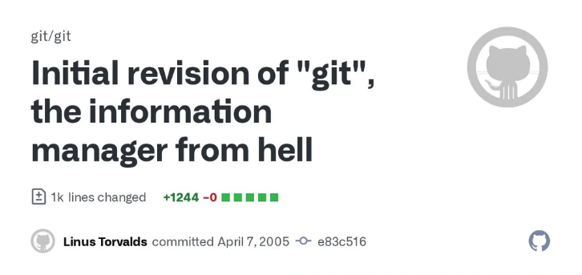
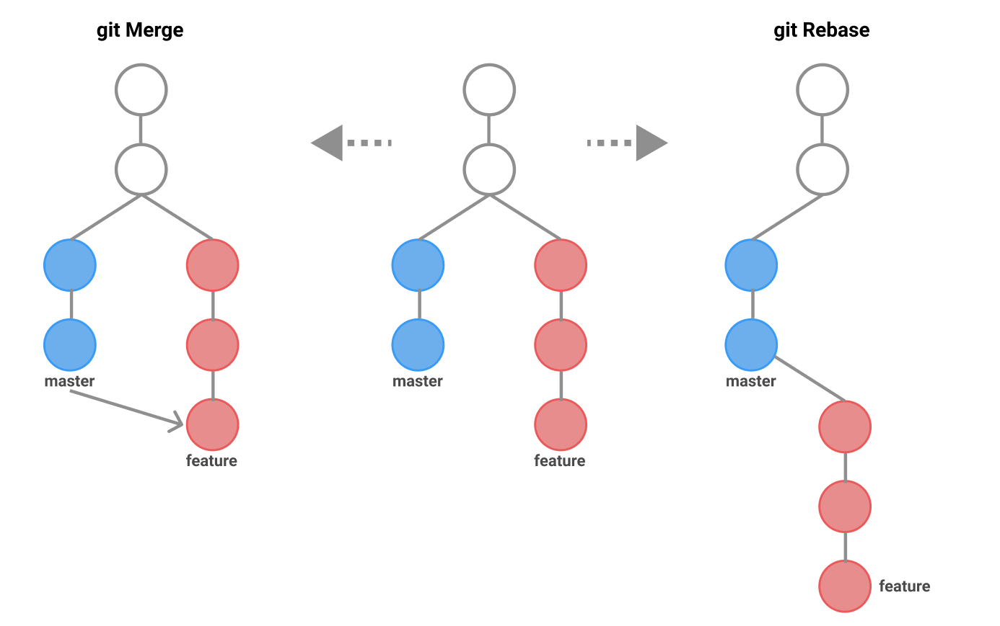

Git
---
<!-- column_layout: [3,2] -->
<!-- column: 0 -->
# Que es?
Software de control de versiones distribuidas.

Creado en 2005 por **Linus Torvalds** durante el desarrollo del kernel de Linux.

<!-- column: 1 -->
<!-- pause -->

<!-- reset_layout -->
<!-- pause -->


# Ventajas y desventajas
<!-- pause -->
<!-- column_layout: [3,3] -->
<!-- column: 0 -->
## Ventajas
- Open Source
- Robusto conjunto de herramientas para el control de versiones de codigo fuente
- Orientado a trabajo no-lineal gracias a las ramas
- Interfaz simple para ser implementada en otros clientes GUI
- Historial limpio y detalladon de los cambios hechos (commits)
- Comunicación con repositorios remotos tanto por HTTP/S o por SSH
<!-- pause -->

<!-- column: 1 -->
## Desventajas
- Mal control de ficheros muy grandes (`git lfs`)
- Problemas al controlar ficheros binarios (Imagenes, compilados, etc)
<!-- reset_layout -->

<!-- end_slide -->

Clientes
---
<!-- pause -->
# CLI
* Git
* [Gitui](https://github.com/extrawurst/gitui)
* [Lazygit](https://github.com/jesseduffield/lazygit)
<!-- pause -->

# Desktop
* [Github Desktop](https://desktop.github.com/download/)
* [Sourcetree](https://www.sourcetreeapp.com/)
* [Gitkraken](https://www.gitkraken.com/)
<!-- pause -->

# Plugins
* [Magit](https://magit.vc/)
* [vim-fugitive](https://github.com/tpope/vim-fugitive)
* Visual Studio Code 👎

<!-- end_slide -->

<!-- jump_to_middle -->
Hands on!
===
<!-- end_slide -->

# Crear un repositorio
```bash +exec
rm -rf .git/
git init
ls -a
```
<!-- pause -->
Como vemos aca, se crea la carpeta `.git` en la raiz del repositorio, donde se almacenan toda la información relevante del repositorio en el
```bash +exec
ls .git
```
<!-- end_slide -->

Comandos básicos
===
<!-- pause -->

# Primer commit
```bash +exec
echo 'Hello world' >> main.txt
git add .
git commit -m 'commit initial'
```
<!-- pause -->

# Ver historial
```bash +exec
git log
```

<!--end_slide -->

# Definir el repositorio remoto
```bash +exec
git branch -M main
git remote add origin git@github.com:fsantand/kt-git.git
```
<!-- pause -->

# Arreglar errores en el ultimo mensaje
```bash +exec
git commit --amend -m 'initial commit'
```
<!-- pause -->

# Empujar los cambios a remoto
```bash +exec
git push -u origin main
```

<!--end_slide -->

<!-- jump_to_middle -->
Workflow en equipos
===
<!-- end_slide -->

Comandos trabajo colaborativo
---

# Traer los cambios más recientes
```bash +exec
git pull
```
<!-- pause -->

# Crear una rama
```bash +exec
git branch rama_1
```
<!-- pause -->

# Cambiar de rama
```bash +exec
git checkout rama_1
```

<!-- end_slide -->

Comandos trabajo colaborativo
---

# Actualizar rama con rama padre
```bash
git checkout main
git pull
git rebase main
```
<!-- pause -->

# Mezclar rama actual con rama objetivo
```bash +exec
echo 'git es la cumbia' > a.txt
git add a.txt
git commit -m 'agregar a.txt'
echo 'git es la mano' >> a.txt
git add a.txt
git commit -m 'modifica a.txt'
git checkout main
git merge --commit rama_1
git push
```
<!-- pause -->

El resultado de esto es un nuevo commit en la rama principal

```bash +exec
git log -m
```

<!-- end_slide -->

Rebase o merge?
---
# El debate
Existe un eterno debate entre si hacer merge o rebase a las ramas al pasar cambios desde una rama a otra.



<!-- pause -->
<!-- column_layout: [1,1] -->
<!-- column: 0 -->
## Rebase
Lleva todos los cambios desde el último commit que se encuentre en la rama feature a la rama main

Este tipo de estrategia de merge es deseado cuando uno trae cambios desde la rama principal hacia la rama feature, con `git rebase`.
<!-- pause -->


<!-- column: 1 -->
## Merge
Crea un commit nuevo referenciando que se hizo un merge desde la rama feature hacia main

Según el manual de git, para ramas de larga vida (**git-flow** con ramas como staging o dev) se aconseja utilizar merge por sobre rebase, pero es muy importante que no sea un squash-merge, ya que estos sobreescriben commits publicos al traspasar de una rama a otra.

<!-- reset_layout -->
<!-- end_slide -->

Merge conflicts
---

# Como se ven?
```javascript
const a = [1,2,3]
<<<<<<<<< HEAD
const b = a.map(x => x*4)
=========
const b = a.map(x => x*(2+2))
>>>>>>>>> feature_branch
console.log(b)
```

es lo mismo que 
<!-- column_layout: [1,1] -->
<!-- column: 0 -->
```javascript
// Rama actual
const a = [1,2,3]
+ const b = a.map(x => x*4)
console.log(b)
```
<!-- column: 1 -->
```javascript
// Rama conflictiva (feature_branch)
const a = [1,2,3]
+ const b = a.map(x => x*(2+2))
console.log(b)
```

<!-- pause -->
<!-- reset_layout -->
# Cuando ocurre?
Esto suele occurrir al traer cambias de otras ramas o al mezclar ramas, y git no puede determinar de manera deterministica (jaja) cual es el commit que debe preservar
<!-- pause -->

## Que hacer?
- Idealmente utilizar una herramienta visual, ya que este proceso es un poco tedioso, especialmente si son muchisimos los conflictos.
- De manera manual, lo que hay que hacer es lo siguiente:
1. Dejar el fragmento de código que corresponda 
2. Eliminar el resto
3. Hacer un stage de los cambios (`git add .`)
4. Dejar correr el resto del merge/rebase con su comando respectivo
<!-- pause -->
<!-- column_layout: [3,3] -->
<!-- column: 0 -->
### Rebase
```bash
git rebase --continue
```
<!-- pause -->

<!-- column: 1 -->
### Merge
```bash
git merge --continue
```

<!-- reset_layout -->
## La embarre, no se que hice, que hago ayuda
Siempre se puede abortar el intento de merge o rebase con la flag `--abort`

<!-- end_slide -->

Comandos utiles
---
# Force push amigable
```bash
git push --force-with-lease
```
o si lo quieren como alias
```bash
alias gpp='git rev-parse --abbrev-ref HEAD | xargs git push --force-with-lease origin '
```

# Traer un commit especifico
```bash
git cherry-pick <HASH>
```

# Agregar cambios a un commit previo
```bash
git commit --fixup HASH
git rebase -i --autosquash OBJETIVO
```

# Rebase y pull en un commando desde remoto
```bash
git pull -r origin main
```

# Crear rama y hacer checkout rapido
```bash
git checkout -b rama_2
```

<!-- end_slide -->

Comandos utiles
---

# Borrar todas las ramas locales ya mergeadas en remoto
```bash
git branch --merged | egrep -v "(^\*|master|main)" | xargs git branch -d
```

# Ver el historial de un solo archivo
```bash
git log --oneline path/to/file
```
<!-- end_slide -->

<!-- jump_to_middle -->
Gracias por su atención
===

<!-- end_slide -->
vim:conceallevel=0:
